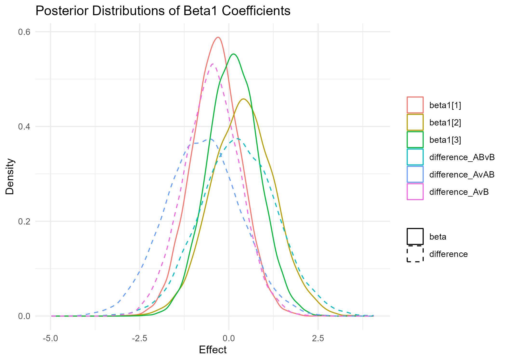
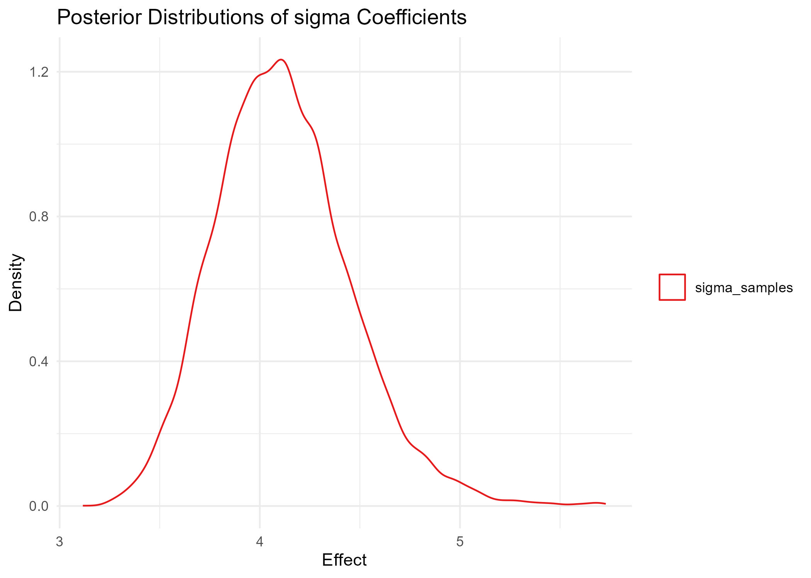

# Bayesian Inference for TSS Measurement Uncertainty
By A.J. Brown <br/>
Agricultural Data Scientist <br/>
[ansleybrown1337@gmail.com](mailto:ansleybrown1337@gmail.com) <br/>
[Personal Website](https://sites.google.com/view/ansleyjbrown/)

This project aims to apply [Bayesian Inference](https://www.youtube.com/watch?v=guTdrfycW2Q) and [Markov Chain Monte Carlo (MCMC)](https://link.springer.com/article/10.3758/s13423-016-1015-8) methods to quantify uncertainty in **Total Suspended Solids (TSS)** measurements and improve the overall accuracy and relaibility of reported TSS values for better decision-making by water resource managers and other stakeholders. 

In our lab, every time we process a batch of water samples for TSS analysis, we also analyze a sample of de-ionized water (DI; ppm of 0) and a sample of a 100 ppm standard solution (STD). We then run these samples through the TSS analysis process, and record the measured TSS values. This allows us to check our TSS analysis process for accuracy and reliability for each batch of samples. Even though we have these standard samples, however, we still have error in our measurements. This error is due to a variety of factors, including the person performing the analysis, the solution being analyzed, and other unknown factors.

Because of this, a need exists to quantify and correct for these confounding factors, and Bayesian Inference and MCMC methods are well-suited for this task. In this project, I aim to establish a robust method for understanding and quantifying the error in TSS measurements taken in my lab. The ultimate goal is to 1) understand the 'real' error in our measurements for reporting, and 2) enhance the accuracy and reliability of measured TSS values from real water samples in various environmental and contexts.

## Table of Contents
- [Objectives](#objectives)
- [Getting Started](#getting-started)
- [Repo Contents](#repo-contents)
- [Methodology](#methodology)
- [Results](#results)
- [Conclusions (Click here for the important stuff)](#conclusions)
- [Contribute](#contribute)
- [License](#license)
- [References](#references)

## Objectives

1. **Quantify Measurement Uncertainty**: Use Bayesian Inference and MCMC to determine the uncertainty in TSS measurements compared to standard measurements.
2. **Adjust Real Water Sample Measurements**: Apply the quantified error margins to adjust TSS measurements obtained from real water samples.

## Getting Started
For this project, I will be using the work flow outlined by Dr. Richard McElreath in his book, [Statistical Rethinking](https://xcelab.net/rm/statistical-rethinking/). This flow is as follows, stated in [Chapter 4, Geocentric Models](https://www.youtube.com/watch?v=tNOu-SEacNU&list=PLDcUM9US4XdPz-KxHM4XHt7uUVGWWVSus&index=3):
1. State a clear question
2. Sketch your causal assumptions
3. Use the sketch to build a generative model
4. Use the model to build estimator
5. Profit

For this project, I will be using the [NIMBLE](https://r-nimble.org/) package in R to implement the Bayesian models and MCMC algorithms. NIMBLE is a flexible, robust, and efficient package for Bayesian statistical modeling, and is well-suited for this project.

## Repo Contents
- `README.md`: This file, serves as a project overview.
- `LICENSE.md`: The license for this project.
- `AUTHORS.md`: The authors of this project.
- `CONTRIBUTING.md`: Guidelines for contributing to this project.
- `Code`: Contains all code for this project.
- `Example Data`: Contains all data for this project.
- `Output`: Contains all output for this project.
- `Repo Images`: Contains all images for this README file.

## Methodology
For exact steps, please navigate to to my , or the [output .html file](Code/tss-uncertainty.html).

### **Defining the OWL:**
#### 1. **State a clear question:**
What is the uncertainty in TSS measurements for both DI and 100ppm standard solutions given each person performing the analysis?

#### 2. **Sketch your causal assumptions:**

The uncertainty in TSS measurements is a function of the person performing the analysis, and other unknown factors ($\epsilon$).

#### 3. **Use the sketch to build a generative model:**

First, we must define what exactly we're looking for, that is, what is the error in our TSS measurements? We can define this as the difference between the measured value and the true value of the standard solution (DI or STD), or:

$$
TSSerr_{i, k} = TSS_{i, k} - TSS_{std, i, k}
$$
    
Where:
- $TSSerr_{i, k}$ is the error in TSS measurement $i$ and standard solution, $k$
- $TSS_{i, k}$ is the measured TSS value for measurement $i$ and standard solution, $k$
- $TSS_{std, i, k}$ is the true TSS value for measurement $i$ and standard solution, $k$

Recall that we have two standard solutions:
- Stock solution of 100 ppm TSS
- De-ionized water (0 ppm TSS)

We also have two (but effectivley three) people performing the analysis:
- Person A
- Person B
- Person A and B (when they did it together)

One way of looking at it is like this:

$$
TSSerr_{i} = f(\beta_0, \beta_1, \epsilon)
$$

*"Measurement error in TSS is some function of the person performing the analysis ($\beta_0$), the solution being analyzed ($\beta_1$), and some unknown error ($\epsilon$)."*

This then can become a deterministic linear model that define the function $f$, where we can quantify the error in TSS measurement $i$ as:

$$
TSSerr_{i} = \alpha_i + \beta_{1, i} * person_i  + \epsilon_{i}
$$
Where:
- $TSSerr_{i}$ is the error in TSS measurement $i$
- $\alpha_i$ is the intercept for TSS measurement $i$
- $\beta_{1, i}$ is the coefficient for the person performing the analysis
- $\epsilon_{i}$ is the error term for TSS measurement $i$ not accounted for here

We then have to make some assumptions of prior distributions for the parameters in our model:

$TSSerr_{i}$ ~ $N(\mu = \alpha_i + \beta_{0, i} * person_i + \beta_{1, i} * solution_{i}, \sigma)$

$\alpha_i$ ~ $N(\mu = 0, \sigma = 1)$

$\beta_1$ ~ $N(\mu = 0, \sigma = 1)$

$\sigma$ ~ $U(0, 100)$

These are relatively non-informative priors, because we don't have any prior knowledge of the parameters, or other literature that we can use to inform our priors. However, the normal distribution is a good choice for the person and solution coefficients, because we expect the person to have a normal distribution of effects on the error in TSS measurement, that is, we expect most readings regardless of person to be near a mean of zero. We also expect the error term to be normally distributed, but we don't know what the mean or standard deviation of the error term is, so we use a uniform distribution to allow the MCMC algorithm to explore the entire parameter space.

So when applied in the context of Bayes Theorem, we have:

$$
Pr(\alpha, \beta_1, \sigma | TSSerr_{i}) = \frac{Pr(TSSerr_{i} | \alpha, \beta_1, \sigma) \times Pr(\alpha, \beta_1, \sigma)}{Z}
$$

Where:
- $Pr(\alpha, \beta_1, \sigma | TSSerr_{i})$ is the posterior distribution of the parameters given the data
- $Pr(TSSerr_{i} | \alpha, \beta_1, \sigma)$ is the likelihood of the data given the parameters
- $Pr(\alpha, \beta_1, \sigma)$ is the prior distribution of the parameters
- $Z$ is the normalizing constant

#### 4. **Use the model to build estimator and interpret results**
Basically, each coefficient of our model (intercept, person, solution) has a unique meaning when our probabilities.

- **$\beta_0$ (Intercept):** This is the baseline level of TSS measurement error when all other predictors (person and solution) are at their reference levels (usually coded as 0 in regression models). It represents the average TSS error when the effects of the person doing the measurement and the solution type are not taken into account. 

    This variable has no real-world meaning, but is useful and necessary for comparing the effects of the other predictors.

- **$\beta_1$ (Person Effect):** These coefficients represent the effects of different individuals (lab technicians) on the TSS measurement error. Each $\beta_1$ coefficient corresponds to a specific person, and the value indicates how much that person's measurements deviate, on average, from the baseline (beta0).

    For example, if you see a difference of -0.45 between the average $\beta_1$ values of Person A and Person B, it suggests that Person A's TSS error is, on average, 0.45 ppm lower than Person B's. This could be interpreted as Person A making slightly more accurate measurements, or Person B making slightly less accurate ones, depending on the context and the direction of the error.

When interpreting these coefficients, especially $\beta_1$ for person effects, it's important to consider:

**Contextual Interpretation:** The meaning of a positive or negative coefficient should be interpreted in the context of how the TSS error is calculated. For instance, if a negative error implies overestimation and a positive error implies underestimation (or vice versa), this should inform how you interpret the coefficients.

**Magnitude and Uncertainty:** In Bayesian analysis, it's not just the point estimate (like the average of beta1 samples) that matters, but also the uncertainty around it. The full posterior distribution of a coefficient should be considered to understand the range of plausible values and the certainty of the estimate. For instance, if the posterior distribution of a coefficient is very wide, it suggests that the estimate is uncertain and could be very different from the point estimate. If the posterior distribution is very narrow, it suggests that the estimate is more certain and is likely to be close to the point estimate.

Remember, the goal of Bayesian inference is not only to estimate these effects but also to understand the uncertainty and variability in these estimates. The posterior distributions of these coefficients, and not just their average values, provide a more comprehensive view of this uncertainty.

#### 5. **Profit**

## **Error Analysis and Adjustment**:
### Error Analysis
Analyze the error characteristics and adjust the measurements of real water samples accordingly.

For this analysis we will calculate the posterior distribution for each model parameter using the MCMC algorithm in the NIMBLE package. **We will then take the difference of the posterior distributions** of the person effects, then compare the means of the difference distribution to determine the difference in TSS error between each person and solution type.

Here are the pairwise comparisons of the posterior distributions of the person effects:

For person effects:
- **Person A - Person AB:**
- **Person A - Person B:**
- **Person B - Person AB:**

### Error Adjustment
Once we are confident in our model, we can use it to adjust the TSS measurements of real water samples. We will use the posterior distributions of the person and solution effects to adjust the TSS measurements of real water samples.

## Results
### Model Convergence
We can check the convergence of our model by looking at the trace plots of the MCMC chains for each parameter. If the chains are well-mixed and stationary, it suggests that the model has converged and the MCMC algorithm has sampled the posterior distribution well.
- [Click here to see the trace plots for the model parameters](Output/trace_density_plots.pdf)

Here is a correlation plot that shows that the chains are well-mixed and stationary:


### Posterior Comparison Results
#### Person Effects
Here are the posterior distributions of the person effects and summary output of the difference distributions:


```
##     beta1[1]          beta1[2]          beta1[3]       difference_AvAB    
##  Min.   :-2.6133   Min.   :-2.5534   Min.   :-2.5171   Min.   :-4.585444  
##  1st Qu.:-0.7905   1st Qu.:-0.2205   1st Qu.:-0.3248   1st Qu.:-1.444647  
##  Median :-0.3288   Median : 0.3900   Median : 0.1328   Median :-0.737617  
##  Mean   :-0.3359   Mean   : 0.3914   Mean   : 0.1403   Mean   :-0.727308  
##  3rd Qu.: 0.1253   3rd Qu.: 0.9910   3rd Qu.: 0.6066   3rd Qu.:-0.001805  
##  Max.   : 2.1224   Max.   : 4.0656   Max.   : 3.1683   Max.   : 2.940299  

##  difference_AvB     difference_ABvB  
##  Min.   :-3.33107   Min.   :-3.7963  
##  1st Qu.:-0.99458   1st Qu.:-0.4737  
##  Median :-0.47484   Median : 0.2639  
##  Mean   :-0.47614   Mean   : 0.2512  
##  3rd Qu.: 0.04926   3rd Qu.: 0.9817  
##  Max.   : 3.00581   Max.   : 4.9020
```

We should also calculate the credible interval for each person effect, letting us know if the distribution of the person effect is significantly different from zero. Here are the 95% credible intervals for each person effect:

| Parameter         | Lower_2.5  | Upper_97.5 | Contains_Zero |
|-------------------|------------|------------|---------------|
| beta1[1]          | -2.032260  | 0.4829960  | TRUE          |
| beta1[2]          | -1.364536  | 1.8886555  | TRUE          |
| beta1[3]          | -1.559233  | 1.0400379  | TRUE          |
| difference_AvAB   | -2.858351  | 0.7912884  | TRUE          |
| difference_AvB    | -1.787295  | 0.7411204  | TRUE          |
| difference_ABvB   | -1.371366  | 2.3942193  | TRUE          |

Since all of the 95% credible intervals contain zero, we now must consider that even though we see differences on average, these differences could be due to chance.

#### Intercept and Sigma Effects
Here are the posterior distributions of the intercept and sigma effects, mainly for reference by the statisticians:


```
##  alpha_samples    
##  Min.   :-2.2315  
##  1st Qu.:-0.2536  
##  Median : 0.1638  
##  Mean   : 0.1538  
##  3rd Qu.: 0.5591  
##  Max.   : 2.4744
```
Remember that the intercept is an imaginary number that simply represents the average TSS measurement for any person assuming they could analyze the same exact standard solution. In other words, imagine if Person A, Person B, and Person AB all analyzed the same exact standard solution. The intercept is the average TSS measurement for that solution.



```
##  sigma_samples  
##  Min.   :3.219  
##  1st Qu.:3.900  
##  Median :4.116  
##  Mean   :4.133  
##  3rd Qu.:4.345  
##  Max.   :5.640 
```
One takeaway here worth noting is that the standard deviation (i.e., sigma) is quite large, which suggests that there is a lot of variability in the data. This distribution does not contain zero, which indicates that there is a significant amount of variability in the data that is not due to chance.

## Conclusions
In summary, we investigated the effects of the person performing the TSS analysis on error incurred as a result. Utilizing a Bayesian analytical framework provided us with a deeper understanding of the uncertainty and variability in our data, an aspect often overlooked in traditional frequentist linear models.

The key takeaway from our findings is that, overall, each technician's performance was quite similar to the others. The presence of zero within the 95% credible intervals for each technician's effect, a unique feature of the Bayesian approach, suggests that while we detected some variability, it does not necessarily indicate substantial or consistent differences in performance. Unlike a frequentist approach that typically offers point estimates and binary conclusions, this Bayesian analysis provides a more nuanced view, with quantified measures of uncertainty for each technician’s TSS readings. The small magnitude of the observed effects further reinforces our conclusion.

Practically speaking, this means that any differences in TSS readings among technicians, though noticeable, are likely to be minor and do not point to significant discrepancies in their overall performance statistically speaking. Our Bayesian approach, focusing on distributions and credible intervals, allows us to draw more informed and cautious conclusions. Thus, we might reasonably conclude that all technicians performed their tasks with a comparable level of accuracy, aligning well with the expected standards of precision in our laboratory processes.

In future work, I plan to apply the calibrated Bayesian model to the entire dataset, further honing in on the effects of the person performing the analysis on the error incurred for real water samples, not just standards. This will extend the insights gained from this study, enabling us to better understand and mitigate variability in our analytical processes."

This revised narrative emphasizes the advantages of the Bayesian method, particularly its ability to handle uncertainty and provide a more comprehensive picture than point estimates common in frequentist approaches. It also sets the stage for future work that builds on these Bayesian insights.

## Contribute

Contributions are always welcome! Please read the [CONTRIBUTING.md](CONTRIBUTING.md) file for details on how to contribute.

## License

This project is licensed under the GNU GPL 2.0 License. See the [LICENSE.md](LICENSE.md) file for details.

## References

- **NIMBLE Development Team. 2023.** *NIMBLE: MCMC, Particle Filtering, and Programmable Hierarchical Modeling.* doi: [10.5281/zenodo.1211190](https://doi.org/10.5281/zenodo.1211190). R package version 1.0.1, [https://cran.r-project.org/package=nimble](https://cran.r-project.org/package=nimble).