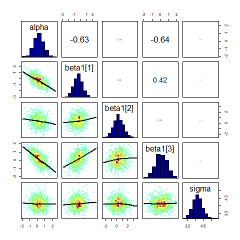
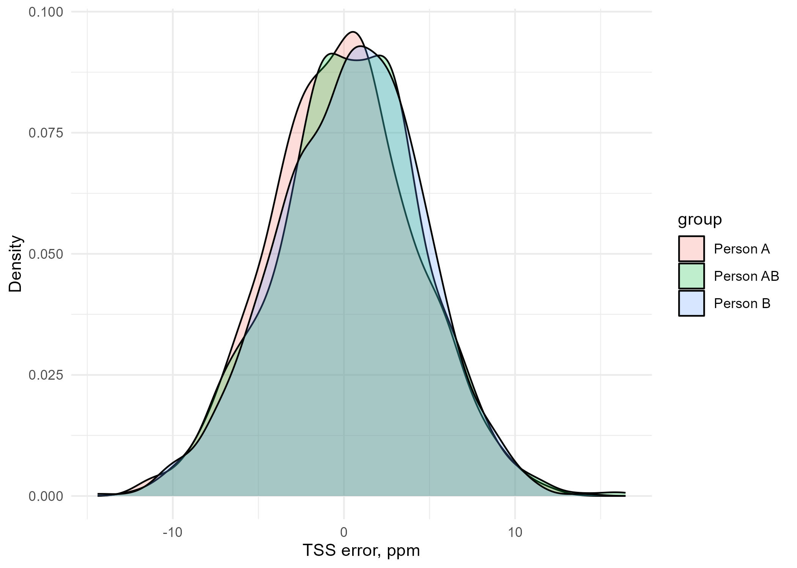
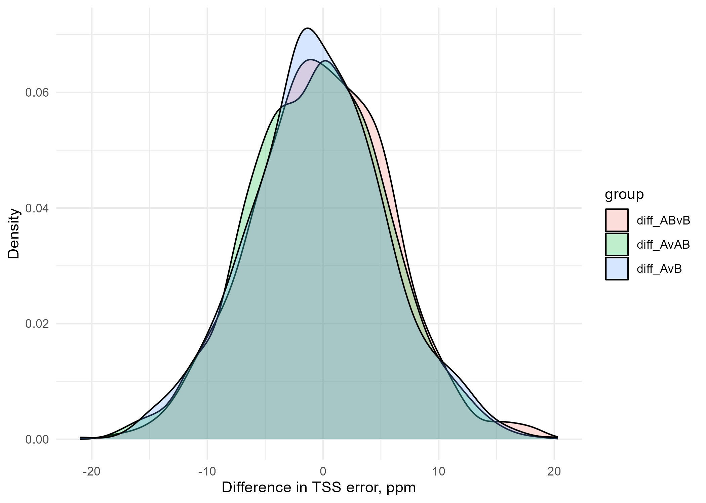

# Bayesian Inference for TSS Measurement Uncertainty
By A.J. Brown <br/>
Agricultural Data Scientist <br/>
[ansleybrown1337@gmail.com](mailto:ansleybrown1337@gmail.com) <br/>
[Personal Website](https://sites.google.com/view/ansleyjbrown/)

This project aims to apply [Bayesian Inference](https://www.youtube.com/watch?v=guTdrfycW2Q) and [Markov Chain Monte Carlo (MCMC)](https://link.springer.com/article/10.3758/s13423-016-1015-8) methods to quantify uncertainty in **Total Suspended Solids (TSS)** measurements and improve the overall accuracy and relaibility of reported TSS values for better decision-making by water resource managers and other stakeholders. 

In our lab, every time we process a batch of water samples for TSS analysis, we also analyze a sample of de-ionized water (DI; ppm of 0) and a sample of a 100 ppm standard solution (STD). We then run these samples through the TSS analysis process, and record the measured TSS values. This allows us to check our TSS analysis process for accuracy and reliability for each batch of samples. Even though we have these standard samples, however, we still have error in our measurements. This error is due to a variety of factors, including the person performing the analysis, the solution being analyzed, and other unknown factors.

Because of this, a need exists to quantify and correct for these confounding factors, and Bayesian Inference and MCMC methods are well-suited for this task. In this project, I aim to establish a robust method for understanding and quantifying the error in TSS measurements taken in my lab. The ultimate goal is to 1) understand the 'real' error in our measurements for reporting, and 2) enhance the accuracy and reliability of measured TSS values from real water samples in various environmental and contexts.

## Table of Contents
- [Objectives](#objectives)
- [Getting Started](#getting-started)
- [Repo Contents](#repo-contents)
- [Methodology](#methodology)
- [Results](#results)
- [Conclusions (Click here for the important stuff!)](#conclusions)
- [Contribute](#contribute)
- [License](#license)
- [References](#references)

## Objectives

1. **Quantify Measurement Uncertainty**: Use Bayesian Inference and MCMC to determine the uncertainty in TSS measurements compared to standard measurements.
2. **Adjust Real Water Sample Measurements**: Apply the quantified error margins to adjust TSS measurements obtained from real water samples.

## Getting Started
For this project, I will be using the work flow outlined by Dr. Richard McElreath in his book, [Statistical Rethinking](https://xcelab.net/rm/statistical-rethinking/). This flow is as follows, stated in [Chapter 4, Geocentric Models](https://www.youtube.com/watch?v=tNOu-SEacNU&list=PLDcUM9US4XdPz-KxHM4XHt7uUVGWWVSus&index=3):
1. State a clear question
2. Sketch your causal assumptions
3. Use the sketch to build a generative model
4. Use the model to build estimator
5. Profit

For this project, I will be using the [NIMBLE](https://r-nimble.org/) package in R to implement the Bayesian models and MCMC algorithms. NIMBLE is a flexible, robust, and efficient package for Bayesian statistical modeling, and is well-suited for this project.

## Repo Contents
- `README.md`: This file, serves as a project overview.
- `LICENSE.md`: The license for this project.
- `AUTHORS.md`: The authors of this project.
- `CONTRIBUTING.md`: Guidelines for contributing to this project.
- `Code`: Contains all code for this project.
- `Example Data`: Contains all data for this project.
- `Output`: Contains all output for this project.
- `Repo Images`: Contains all images for this README file.

## Methodology
For exact steps and code, please view the [output .html file](Code/tss-uncertainty.html).

### **Defining the OWL:**
#### 1. **State a clear question:**
What is the uncertainty in TSS measurements for both DI and 100ppm standard solutions given each person performing the analysis?

#### 2. **Sketch your causal assumptions:**

The uncertainty in TSS measurements is a function of the person performing the analysis, and other unknown factors ($\epsilon$).

#### 3. **Use the sketch to build a generative model:**

First, we must define what exactly we're looking for, that is, what is the error in our TSS measurements? We can define this as the difference between the measured value and the true value of the standard solution (DI or STD), or:


$$
TSSerr_{i, k} = TSS_{i, k} - TSS_{std, i, k}
$$
    

Where:
- $TSSerr_{i, k}$ is the error in TSS measurement $i$ and standard solution, $k$
- $TSS_{i, k}$ is the measured TSS value for measurement $i$ and standard solution, $k$
- $TSS_{std, i, k}$ is the true TSS value for measurement $i$ and standard solution, $k$

Recall that we have two standard solutions:
- Stock solution of 100 ppm TSS
- De-ionized water (0 ppm TSS)

We also have two (but effectivley three) people performing the analysis:
- Person A
- Person B
- Person A and B (when they did it together)

One way of looking at it is like this:

$$
TSSerr_{i} = f(\beta_1, \epsilon)
$$

*"Measurement error in TSS is some function of the person performing the analysis ($\beta_1$),  and some unknown error ($\epsilon$)."*

This then can become a deterministic linear model that define the function $f()$, where we can quantify the error in TSS measurement $i$ as:

$$
TSSerr_{i} = \alpha_k + \beta_{1, k} * person_k  + \epsilon
$$
Where:
- $TSSerr_{i}$ is the error in TSS measurement $i$ <br/>
- $\alpha_k$ is the intercept for person $k$ <br/>
- $\beta_{1, k}$ is the fitting coefficient for the person effect, $k$ <br/>
- $\epsilon$ is the error term for TSS measurement

We then have to make some assumptions of prior distributions for the parameters in our model:

$TSSerr_{i}$ ~ $N(\mu = \alpha_i + \beta_{0, i} * person_i, \sigma)$

$\alpha_i$ ~ $N(\mu = 0, \sigma = 1)$

$\beta_1$ ~ $N(\mu = 0, \sigma = 1)$

$\sigma$ ~ $U(0, 100)$

These are relatively non-informative priors, because we don't have any prior knowledge of the parameters, or other literature that we can use to inform our priors. However, the normal distribution is a good choice for the person and solution coefficients, because we expect the person to have a normal distribution of effects on the error in TSS measurement, that is, we expect most readings regardless of person to be near a mean of zero. We also expect the error term to be normally distributed, but we don't know what the mean or standard deviation of the error term is, so we use a uniform distribution to allow the MCMC algorithm to explore the entire parameter space.

So when applied in the context of Bayes Theorem, we have:

$$
Pr(\alpha, \beta_1, \sigma | TSSerr_{i}) = \frac{Pr(TSSerr_{i} | \alpha, \beta_1, \sigma) \times Pr(\alpha, \beta_1, \sigma)}{Z}
$$

Where:
- $Pr(\alpha, \beta_1, \sigma | TSSerr_{i})$ is the posterior distribution of the parameters given the data
- $Pr(TSSerr_{i} | \alpha, \beta_1, \sigma)$ is the likelihood of the data given the parameters
- $Pr(\alpha, \beta_1, \sigma)$ is the prior distribution of the parameters
- $Z$ is the normalizing constant

#### 4. **Use the model to build estimator and interpret results**
Basically, each coefficient of our model (intercept, person, solution) has a unique meaning when our probabilities.

- **$\alpha$ (Intercept):** This is the baseline level of TSS measurement error when all other predictors (person and solution) are at their reference levels (usually coded as 0 in regression models). It represents the average TSS error when the effects of the person doing the measurement and the solution type are not taken into account. 

    This variable has no real-world meaning, but is useful and necessary for comparing the effects of the other predictors.

- **$\beta_1$ (Person Effect):** These coefficients represent the effects of different individuals (lab technicians) on the TSS measurement error. Each $\beta_1$ coefficient corresponds to a specific person, and the value indicates how much that person's measurements deviate, on average, from the baseline (beta0).

    For example, if you see a difference of -0.45 between the average $\beta_1$ values of Person A and Person B, it suggests that Person A's TSS error is, on average, 0.45 ppm lower than Person B's. This could be interpreted as Person A making slightly more accurate measurements, or Person B making slightly less accurate ones, depending on the context and the direction of the error.

When interpreting these coefficients, especially $\beta_1$ for person effects, it's important to consider:

**Contextual Interpretation:** The meaning of a positive or negative coefficient should be interpreted in the context of how the TSS error is calculated. For instance, if a negative error implies overestimation and a positive error implies underestimation (or vice versa), this should inform how you interpret the coefficients.

**Magnitude and Uncertainty:** In Bayesian analysis, it's not just the point estimate (like the average of beta1 samples) that matters, but also the uncertainty around it. The full posterior distribution of a coefficient should be considered to understand the range of plausible values and the certainty of the estimate. For instance, if the posterior distribution of a coefficient is very wide, it suggests that the estimate is uncertain and could be very different from the point estimate. If the posterior distribution is very narrow, it suggests that the estimate is more certain and is likely to be close to the point estimate.

Remember, the goal of Bayesian inference is not only to estimate these effects but also to understand the uncertainty and variability in these estimates. The posterior distributions of these coefficients, and not just their average values, provide a more comprehensive view of this uncertainty.

#### 5. **Profit**

## **Error Analysis and Adjustment**:
### Error Analysis
Analyze the error characteristics and adjust the measurements of real water samples accordingly.

For this analysis we will calculate the posterior distribution for each model parameter using the MCMC algorithm in the NIMBLE package. **We will then take the difference of the posterior distributions** of the person effects, then compare the means of the difference distribution to determine the difference in TSS error between each person and solution type.

Here are the pairwise comparisons of the posterior distributions of the person effects:

For person effects:
- **Person A - Person AB:**
- **Person A - Person B:**
- **Person B - Person AB:**

### Error Adjustment
Once we are confident in our model, we can use it to adjust the TSS measurements of real water samples. We will use the posterior distributions of the person and solution effects to adjust the TSS measurements of real water samples.

> [!NOTE]
> **Spoiler alert:** The results of this analysis suggest that the person and solution effects are not statistically significant, so there was no need to adjust the TSS measurements of real water samples! More information on this can be found in the [Person Effects](#person-effects) section of the results.

## Results
### Model Convergence
#### Trace and marginal density plots
We can check the convergence of our model by looking at the trace plots of the MCMC chains for each parameter. If the chains are well-mixed and stationary, it suggests that the model has converged and the MCMC algorithm has sampled the posterior distribution well.
- [Click here to see the trace plots for the model parameters](Output/trace_density_plots.pdf)

You can see in the trace plots that the chains are well-mixed and stationary, and the posterior distributions are well-sampled overall.

#### Correlation plots

Additionaly, we may want to investigate correlation between variables.  The `correlationPlot()` function in the `BayesianTools` package can be used to visualize the correlation between variables in the MCMC chains:



#### Gelman chain convergence

Thirdly, we will also check how two chains from the same NIMBLE model converged using the `gelman.diag()` and `gelman.plot()` functions as found in the `BayesianTools` package:

```
Potential scale reduction factors:

         Point est. Upper C.I.
alpha             1       1.00
beta1[1]          1       1.00
beta1[2]          1       1.00
beta1[3]          1       1.00
sigma             1       1.01

Multivariate psrf
```


The `gelman.diag()` function gives you the scale reduction factors for each parameter. A factor of 1 means that between variance and within chain variance are equal, larger values mean that there is still a notable difference between chains. Often, it is said that everything below 1.1 or so is OK, but note that this is more a rule of thumb. 

The `gelman,plot()` function shows you the development of the scale-reduction over time (chain steps), which is useful to see whether a low chain reduction is also stable (sometimes, the factors go down and then up again, as you will see). The gelman plot is also a nice tool to see roughly where this point is, that is, from which point on the chains seem roughly converged. You can see that both chains converge to eachother around the value of zero after the 10,000 iterations mark. This is a good sign that our model has converged.

### Posterior predictive checks
Finally, we would like to do the posterior predictive checks for the NIMBLE model to see how it captures TSS error overall. Using a NIMBLE function to generate simulated TSS error, we will compare resulting simulated mean , median, min and max value distributions to the observed TSS error summary statistic:


Overall, it would appear that our model captures the TSS error well. The bulk of our predicted samples align closely with each observed value (i.e., the red line) for mean, median, and max. However, the observed min seems to be on the lower tail of our predicted distribution, indicating that our model may not simulate the lower error values as well. This could be due to the little number of observed samples at lower (i.e. more negative) values.  The bulk of our values lie near zero, making this harder to simulate without more data.

#### Summary of convergence

Considering all of the above, that is, the trace plots, correlation plots, and gelman plots, we can conclude that our model has converged and the MCMC algorithm has sampled the posterior distribution well.

### Posterior Comparison Results
#### Person Effects
Here are the posterior distributions of the person effects:


Even though these distributions are very similar, to determine if there are any significant differences between the person effects, we can take the difference of the posterior distributions of the person effects, then compare the means of the difference distribution to determine the difference in TSS error between each person. In the Bayesian approach, it is critical that you take the difference between *whole distributions* and not just the means of the distributions. This is because the distributions contain information about the uncertainty in the estimates, and the difference of the distributions will also contain information about the uncertainty in the difference of the estimates.

As such, here are the posterior distributions of the differences between the person effects:


Now we can summarize these difference distributions and compare the means, medians, and 95% credible intervals to determine if there are any significant differences between the person effects:

| Group    | Lower_2.5 | Upper_97.5 | Mean        | Median      | Contains_Zero |
|----------|-----------|------------|-------------|-------------|---------------|
| diff_ABvB| -11.74271 | 11.88146   | 0.1638900   | 0.06128693  | TRUE          |
| diff_AvAB| -11.91252 | 10.71047   | -0.7649288  | -0.62108427 | TRUE          |
| diff_AvB | -12.28966 | 11.09072   | -0.6010389  | -0.68168872 | TRUE          |


Keeping in mind that the units for this table are in ppm (or mg/L), the mean and median values for each difference are close to zero (< 1 ppm away). Additionally, the 95% credible intervals for all difference distributions contain zero. This indicates that all lab technicians are performing rather well, with very little difference between persons.

## Conclusion

This project set out to apply Bayesian Inference and Markov Chain Monte Carlo (MCMC) methods to better understand and quantify the uncertainty in Total Suspended Solids (TSS) measurements in our laboratory setting. The objective was twofold: 1) to quantify measurement uncertainty and 2) to adjust real water sample measurements for improved accuracy and reliability. 

The results from objective 1 were more ideal than expected, as the analysis revealed that while there are slight variations in measurements due to different personnel and other factors, these variations are within an acceptable range (< 1 ppm or mg/L). Furthmore, The 95% credible intervals calculated for each person's measurement errors include zero, indicating that firstly, all persons are having very low TSS error on their standards and secondly, that there is no significant error differences between lab technicians.

Because no significant error was found in the TSS standards, we eliminated the need for adjusting the remaining 'real' water sample TSS measurements. Moving forward, we recommend that the Bayesian framework be applied to future data to ensure that the measurement process remains consistent and reliable between new personnel and new batches of standards.

In summary, the application of Bayesian Inference and MCMC methods has successfully provided a deeper understanding of the uncertainties in TSS measurements in our laboratory. The findings affirm the accuracy and consistency of our measurement procedures, bolstering confidence in the data used for environmental analysis and decision-making. The project not only highlights the effectiveness of the current laboratory practices but also lays a foundation for future research and continuous improvement in the field of environmental monitoring.

---

**[Return to Top](#table-of-contents)**

## Contribute

Contributions are always welcome! Please read the [CONTRIBUTING.md](CONTRIBUTING.md) file for details on how to contribute.

## License

This project is licensed under the GNU GPL 2.0 License. See the [LICENSE.md](LICENSE.md) file for details.

## References

- **NIMBLE Development Team. 2023.** *NIMBLE: MCMC, Particle Filtering, and Programmable Hierarchical Modeling.* doi: [10.5281/zenodo.1211190](https://doi.org/10.5281/zenodo.1211190). R package version 1.0.1, [https://cran.r-project.org/package=nimble](https://cran.r-project.org/package=nimble).